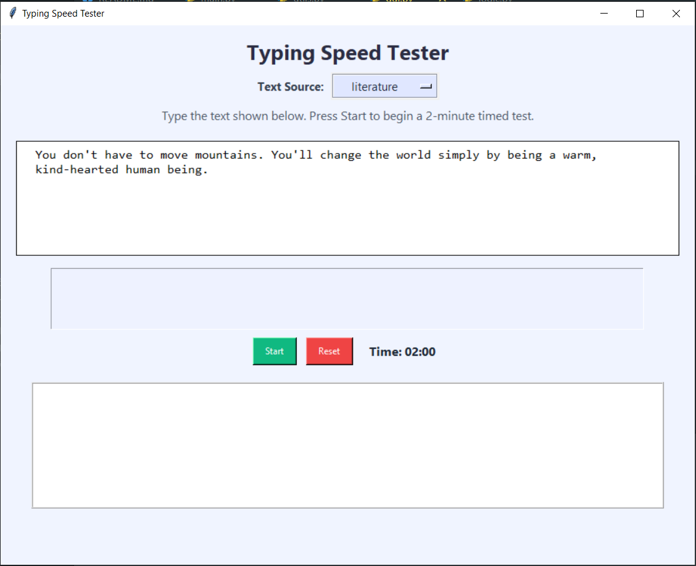
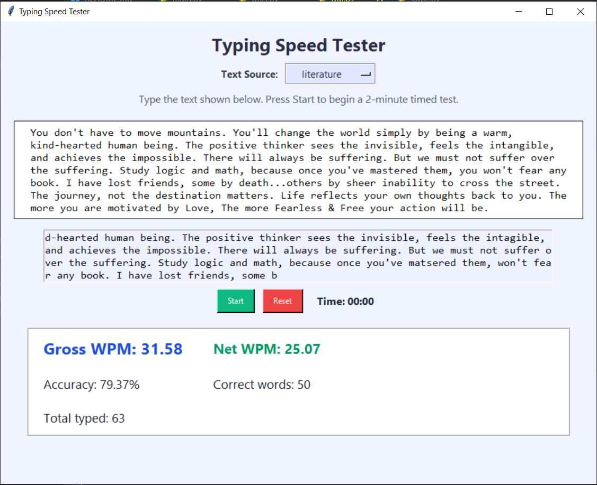

# ⌨️ Typing Speed Tester

A small Python/Tkinter app to measure typing speed (WPM) and accuracy with selectable text sources.

## ✨ Features

- Selectable text source: "literature" (real quotes via APIs) or "random" (local gibberish).
- 2-minute timed typing test (default).
- Dynamic text extension while typing when you near the end of the provided text.
- Gross WPM, Net WPM (correct words), accuracy percentage, total typed and correct word counts are shown.
- Simple, styled Tkinter UI with a source dropdown and start/reset controls.
- Offline-safe: when external quote APIs fail, a local random-word fallback is used.

## 🚀 Installation

Requires Python 3.7+.

Install dependencies:

```bash
pip install -r requirements.txt
```

Notes:

- Tkinter is part of the standard library for most Python distributions (on some linux systems you may need to install a separate tk package).
- The app optionally uses the internet to fetch quotes; if requests to APIs fail the app will fall back to locally generated random words.

## ▶️ Running the App

From the project root:

```bash
python main.py
```

The main window provides:

- "Text Source" dropdown to choose between "literature" (default) and "random".
- "Start" to begin the 2-minute test.
- "Reset" to stop and refresh the test text.
- Results card showing Gross WPM, Net WPM, Accuracy, Correct words and Total typed.

## 🖼️ App Screens

#### Screenshot 1 — Main view (typing area + controls):
   

#### Screenshot 2 — Results card after finishing:



## 🧭 Behavior Details / Tips

- "literature" attempts to fetch quotes from ZenQuotes then DummyJSON; if both fail the app uses a local random-word generator.
- While typing, if you approach the end of the displayed text the app auto-appends additional text so you can keep typing without interruption.
- Accuracy is calculated as (correct words / total typed words) * 100.
- Gross WPM is based on total typed words; Net WPM uses only correct words.

## Contributing

Contributions welcome. Fork, make changes, and submit a PR. Please keep UI/text source behavior consistent with existing code.

## License

This project is open-source and available under the MIT License.
